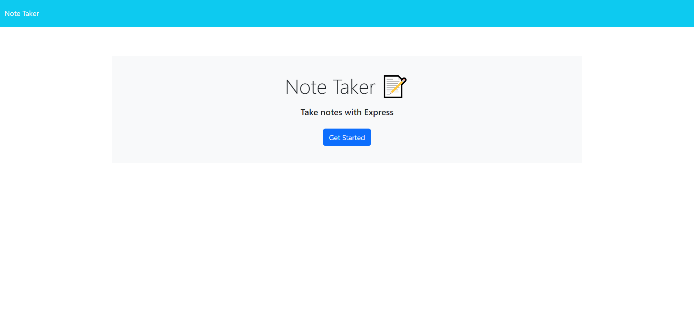
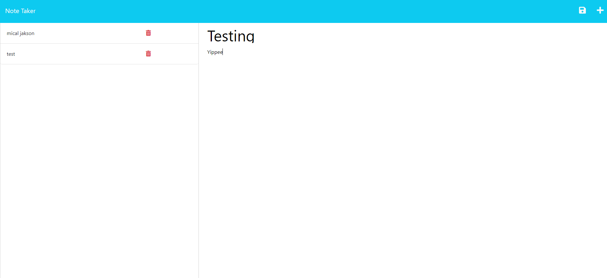

# Note Taker

## Description

- My motivation for this project was to create a note taker that stores said notes, allows them to be deleted, and add more when needed.
- I built this project to further utilize knowledge of express and create a useful tool for users.
- This code is effective in keeping notes stored and organized.
- Composing this note taker, I learned much more about how to utilize Express in an effective and helpful way for users.

## Github
- [Github Repository](https://github.com/Celyph/note-taker)

## Usage

## Credits

I used the ReadMe guide from [https://coding-boot-camp.github.io/full-stack/github/professional-readme-guide](https://coding-boot-camp.github.io/full-stack/github/professional-readme-guide).